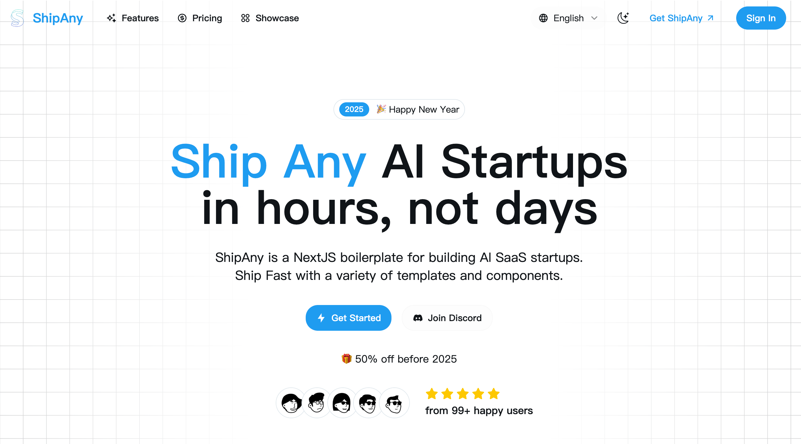

# Nano Banana Pro

Smart AI image editing, enhancement, and transformation tool — live at https://www.nanobananapro.lol.



## Quick Start

1. Clone the repository

```bash
git clone https://github.com/shipanyai/shipany-template-one.git
```

2. Install dependencies

```bash
npm install
```

3. Run the default web development server

```bash
npm run dev
```

`npm run dev` now auto-starts the local backend on `http://127.0.0.1:5000` when
the backend target is local. Set `BACKEND_AUTOSTART=false` to keep frontend-only
development and start the backend manually.

## Runtime Profiles

This repo uses isolated Next.js output directories so concurrent local runtimes cannot corrupt each other's manifests or chunks.

- `npm run dev` or `npm run dev:web`: normal local development on `http://localhost:3000`
- `npm run dev:playwright`: browser-test runtime on `http://localhost:3002` with `NEXT_PUBLIC_AUTH_DISABLED=true`
- `npm run dev:turbo`: experimental Turbopack dev server using the same isolated web profile
- `npm run build`: production build written to `.next/build`
- `npm run start`: serves the production build from `.next/build`
- `npm run dev:reset`: removes `.next/dev-web`, `.next/dev-playwright`, `.next/build`, runtime locks, and test artifacts

Do not run bare `next dev` in this repository. Use the npm scripts so each runtime gets its own `distDir` and lock guard.

## Testing

Run the runtime guard tests:

```bash
npm run test:runtime
```

Run browser tests:

```bash
npm run test:e2e
```

The homepage hydration regression is covered by Playwright. It fails if the homepage loads with missing `/_next/static/chunks/...` assets or loses client interactivity.

## Browser Debug Scripts

Ad hoc browser debug scripts now live under `scripts/browser-debug/` and read `TEST_BASE_URL` instead of hardcoding `http://localhost:3000`.

Examples:

```bash
TEST_BASE_URL=http://localhost:3000 npx tsx scripts/browser-debug/test-signin-click.ts
TEST_BASE_URL=http://localhost:3002 npx tsx scripts/browser-debug/test-deploy-button.ts
```

## Customize

- Set your environment variables

```bash
cp .env.example .env.development
```

- Set your theme in `src/app/theme.css`

[tweakcn](https://tweakcn.com/editor/theme)

- Set your landing page content in `src/i18n/pages/landing`

- Set your i18n messages in `src/i18n/messages`

## Deploy

- Deploy to Vercel

[](https://vercel.com/new/clone?repository-url=https%3A%2F%2Fgithub.com%2Fshipanyai%2Fshipany-template-one&project-name=my-shipany-project&repository-name=my-shipany-project&redirect-url=https%3A%2F%2Fshipany.ai&demo-title=ShipAny&demo-description=Ship%20Any%20AI%20Startup%20in%20hours%2C%20not%20days&demo-url=https%3A%2F%2Fshipany.ai&demo-image=https%3A%2F%2Fpbs.twimg.com%2Fmedia%2FGgGSW3La8AAGJgU%3Fformat%3Djpg%26name%3Dlarge)

- Deploy to Cloudflare

for new project, clone with branch "cloudflare"

```shell
git clone -b cloudflare https://github.com/shipanyai/shipany-template-one.git
```

for exist project, checkout to branch "cloudflare"

```shell
git checkout cloudflare
```

1. Customize your environment variables

```bash
cp .env.example .env.production
cp wrangler.toml.example wrangler.toml
```

edit your environment variables in `.env.production`

and put all the environment variables under `[vars]` in `wrangler.toml`

2. Deploy

```bash
npm run cf:deploy
```

## Community

- [ShipAny](https://shipany.ai)
- [Documentation](https://docs.shipany.ai)

## License

- [ShipAny AI SaaS Boilerplate License Agreement](LICENSE)
