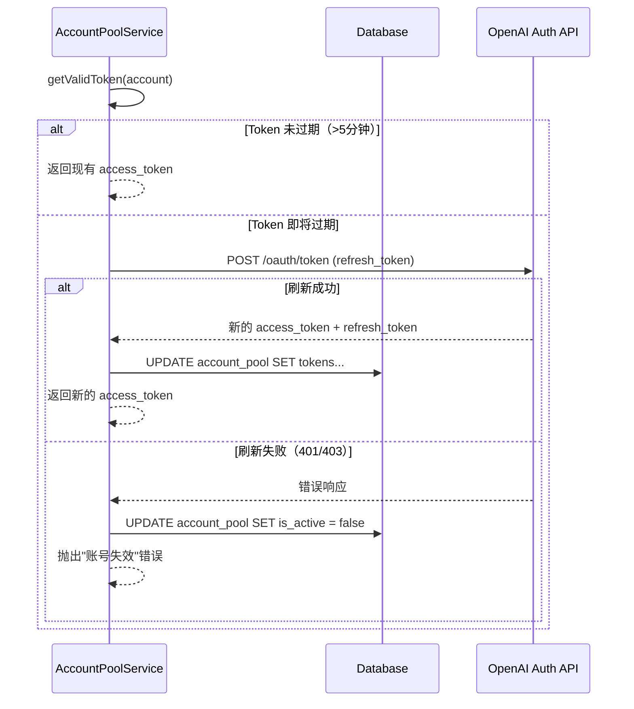

# EasyClaw 账号池 1:1 预分配功能 - 设计文档

## 1. 架构概览

```
┌─────────────────────────────────────────────────────────────────────────────┐
│                                 用户层                                       │
│  ┌──────────────┐     ┌──────────────┐     ┌──────────────┐                │
│  │   首次部署    │────▶│  分配并绑定   │────▶│   启动容器    │                │
│  └──────────────┘     │    账号      │     │  (OAuth)     │                │
│                       └──────────────┘     └──────────────┘                │
│                              │                                              │
│  ┌──────────────┐            │              ┌──────────────┐                │
│  │   再次部署    │────────────┴─────────────▶│   复用账号    │                │
│  └──────────────┘                           │   启动容器    │                │
│                                             └──────────────┘                │
└─────────────────────────────────────────────────────────────────────────────┘
                                       │
                                       ▼
┌─────────────────────────────────────────────────────────────────────────────┐
│                                服务层                                        │
│  ┌──────────────────────────────────────────────────────────────────────┐  │
│  │                     AccountPoolService                                │  │
│  │  ┌─────────────┐  ┌─────────────┐  ┌─────────────┐  ┌─────────────┐ │  │
│  │  │ getOrAssign │  │refreshToken │  │getValidToken│  │updateUsage  │ │  │
│  │  └─────────────┘  └─────────────┘  └─────────────┘  └─────────────┘ │  │
│  └──────────────────────────────────────────────────────────────────────┘  │
└─────────────────────────────────────────────────────────────────────────────┘
                                       │
                                       ▼
┌─────────────────────────────────────────────────────────────────────────────┐
│                                数据层                                        │
│  ┌─────────────────────┐     ┌─────────────────────────────────────────┐   │
│  │   account_pool      │     │           deployments                    │   │
│  │  (账号池表)          │     │          (部署记录表)                   │   │
│  ├─────────────────────┤     ├─────────────────────────────────────────┤   │
│  │ id (PK)             │◀────┤ account_id (FK)                         │   │
│  │ access_token_enc    │     │ id (PK)                                 │   │
│  │ refresh_token_enc   │     │ user_id                                 │   │
│  │ expires_at          │     │ status                                  │   │
│  │ account_id (唯一)    │     │ telegram_token_enc                      │   │
│  │ is_bound            │     │ ...                                     │   │
│  │ bound_user_id       │     │                                         │   │
│  │ is_active           │     │                                         │   │
│  └─────────────────────┘     └─────────────────────────────────────────┘   │
└─────────────────────────────────────────────────────────────────────────────┘
                                       │
                                       ▼
┌─────────────────────────────────────────────────────────────────────────────┐
│                               容器层                                         │
│  ┌──────────────────────────────────────────────────────────────────────┐  │
│  │                    OpenClaw Container                                 │  │
│  │  ┌─────────────────────────────────────────────────────────────────┐ │  │
│  │  │  Volume Mount: /var/lib/easyclaw/{deploymentId}                │ │  │
│  │  │                    ↓                                            │ │  │
│  │  │  /home/node/.openclaw/agents/default/agent/auth-profiles.json  │ │  │
│  │  │  /home/node/.openclaw/openclaw.json                            │ │  │
│  │  └─────────────────────────────────────────────────────────────────┘ │  │
│  └──────────────────────────────────────────────────────────────────────┘  │
└─────────────────────────────────────────────────────────────────────────────┘
```

---

## 2. 数据库设计

### 2.1 表结构

#### account_pool（账号池表）

| 字段名 | 类型 | 约束 | 说明 |
|--------|------|------|------|
| id | uuid | PK, defaultRandom() | 主键 |
| access_token_encrypted | text | NOT NULL | 加密后的 access_token |
| refresh_token_encrypted | text | NOT NULL | 加密后的 refresh_token |
| expires_at | timestamptz | NOT NULL | Token 过期时间 |
| account_id | varchar(255) | UNIQUE, NOT NULL | OpenAI 账号标识（如邮箱） |
| email | varchar(255) | NULL | 管理员备注 |
| is_bound | boolean | DEFAULT false | 是否已被绑定 |
| bound_user_id | varchar(255) | NULL | 绑定的用户 UUID |
| bound_at | timestamptz | NULL | 绑定时间 |
| is_active | boolean | DEFAULT true | 账号是否有效 |
| failure_count | integer | DEFAULT 0 | 失败次数 |
| last_used_at | timestamptz | NULL | 最后使用时间 |
| created_at | timestamptz | DEFAULT now() | 创建时间 |
| updated_at | timestamptz | DEFAULT now() | 更新时间 |

#### deployments（部署记录表 - 扩展）

| 字段名 | 类型 | 约束 | 说明 |
|--------|------|------|------|
| id | uuid | PK, defaultRandom() | 主键 |
| user_id | varchar(255) | NOT NULL | 用户 UUID |
| account_id | uuid | FK → account_pool.id | 绑定的账号 |
| status | varchar(50) | DEFAULT 'provisioning' | 状态 |
| telegram_token_encrypted | text | NOT NULL | 加密的 Telegram Token |
| error_message | text | NULL | 错误信息 |
| created_at | timestamptz | DEFAULT now() | 创建时间 |
| updated_at | timestamptz | DEFAULT now() | 更新时间 |

### 2.2 索引

```sql
-- 账号池索引
CREATE INDEX idx_account_pool_status ON account_pool(is_bound, is_active);
CREATE INDEX idx_account_pool_bound_user ON account_pool(bound_user_id) WHERE is_bound = true;

-- 部署记录索引
CREATE INDEX idx_deployments_user ON deployments(user_id);
CREATE INDEX idx_deployments_account ON deployments(account_id);
```

### 2.3 Drizzle Schema

```typescript
// src/db/schema.ts 新增

export const accountPool = easyclawSchema.table("account_pool", {
  id: uuid("id").primaryKey().defaultRandom(),
  access_token_encrypted: text().notNull(),
  refresh_token_encrypted: text().notNull(),
  expires_at: timestamp({ withTimezone: true }).notNull(),
  account_id: varchar({ length: 255 }).notNull().unique(),
  email: varchar({ length: 255 }),
  is_bound: boolean().notNull().default(false),
  bound_user_id: varchar({ length: 255 }),
  bound_at: timestamp({ withTimezone: true }),
  is_active: boolean().notNull().default(true),
  failure_count: integer().notNull().default(0),
  last_used_at: timestamp({ withTimezone: true }),
  created_at: timestamp({ withTimezone: true }).defaultNow(),
  updated_at: timestamp({ withTimezone: true }).defaultNow(),
});

// deployments 表扩展 account_id 字段
// 使用 migration 文件添加
```

---

## 3. 核心流程设计

### 3.1 账号分配流程

```mermaid
sequenceDiagram
    participant U as 用户
    participant API as Deploy API
    participant S as AccountPoolService
    participant DB as Database
    participant Docker as DockerService

    U->>API: POST /deploy (首次)
    API->>S: getOrAssignAccount(userId)
    
    alt 用户已绑定账号
        S->>DB: SELECT * FROM account_pool WHERE bound_user_id = $1
        DB-->>S: 返回已绑定账号
        S-->>API: 返回账号信息
    else 用户未绑定
        S->>DB: UPDATE account_pool SET is_bound = true, ... 
              WHERE id = (SELECT id FROM account_pool 
                          WHERE is_bound = false AND is_active = true 
                          LIMIT 1 FOR UPDATE SKIP LOCKED)
        alt 分配成功
            DB-->>S: 返回新分配账号
            S-->>API: 返回账号信息
        else 账号池耗尽
            S-->>API: 抛出"暂无可用账号"错误
        end
    end
    
    API->>Docker: createContainerWithAccount(account)
    Docker-->>API: containerId
    API->>DB: UPDATE deployments SET status = 'running'
    API-->>U: deploymentId
```

### 3.2 Token 刷新流程



### 3.3 容器启动流程

```mermaid
sequenceDiagram
    participant DS as DockerService
    participant FS as FileSystem
    participant C as Container
    participant OC as OpenClaw CLI

    DS->>DS: createOpenClawContainerWithAccount()
    
    DS->>FS: mkdir -p {stateDir}/agents/default/agent
    DS->>FS: write auth-profiles.json
    Note over FS: 包含 OAuth Token
    DS->>FS: write openclaw.json
    Note over FS: 基础配置
    
    DS->>C: docker.createContainer({
        Binds: [{stateDir}:/home/node/.openclaw]
    })
    DS->>C: container.start()
    
    DS->>OC: openclaw doctor --fix
    DS->>OC: openclaw models set {model}
    DS->>OC: openclaw config set channels.telegram ...
    DS->>OC: openclaw models auth order set --agent default openai-codex:{accountId}
    
    C-->>DS: 容器就绪
```

---

## 4. 接口设计

### 4.1 内部服务接口

#### AccountPoolService

```typescript
interface Account {
  id: string;
  accessToken: string;
  refreshToken: string;
  expiresAt: Date;
  accountId: string;  // OpenAI account identifier
}

class AccountPoolService {
  /**
   * 获取或分配用户绑定的账号
   * 优先返回已绑定的账号，否则分配新账号
   * @throws {Error} 账号池耗尽时抛出
   */
  async getOrAssignAccount(userId: string): Promise<Account>;

  /**
   * 刷新账号的 access token
   * @throws {Error} 刷新失败时抛出并标记账号失效
   */
  async refreshAccountToken(accountId: string): Promise<Account>;

  /**
   * 获取有效的 access token（自动刷新）
   */
  async getValidToken(account: Account): Promise<string>;

  /**
   * 更新账号最后使用时间
   */
  async updateAccountUsage(accountId: string): Promise<void>;
}
```

#### DockerService 扩展

```typescript
interface CreateContainerWithAccountInput {
  telegramToken: string;
  model?: string;
  deploymentId: string;
  account: Account;
}

async function createOpenClawContainerWithAccount(
  input: CreateContainerWithAccountInput
): Promise<string>; // 返回 containerId
```

### 4.2 管理员接口

```typescript
// POST /admin/accounts/import (仅管理员)
interface ImportAccountsRequest {
  accounts: Array<{
    accessToken: string;
    refreshToken: string;
    expiresAt: string;  // ISO 8601
    accountId: string;
    email?: string;
  }>;
}

// GET /admin/accounts/stats (仅管理员)
interface AccountStatsResponse {
  total: number;      // 账号总数
  available: number;  // 未绑定且有效
  bound: number;      // 已绑定
  inactive: number;   // 已失效
}

// GET /admin/accounts (仅管理员)
interface ListAccountsResponse {
  accounts: Array<{
    id: string;
    accountId: string;
    email?: string;
    isBound: boolean;
    boundUserId?: string;
    isActive: boolean;
    lastUsedAt?: string;
    createdAt: string;
  }>;
}
```

---

## 5. 安全设计

### 5.1 数据加密

```
┌─────────────────────────────────────────────────────────────┐
│                      加密流程                                │
├─────────────────────────────────────────────────────────────┤
│                                                             │
│   明文 Token          加密 (AES-256-GCM)          密文存储    │
│   ┌─────────┐        ┌──────────────┐         ┌──────────┐  │
│   │ access  │───────▶│ encryptSecret│────────▶│ DB: text │  │
│   │ refresh │        └──────────────┘         └──────────┘  │
│   └─────────┘              ▲                                │
│                            │                                │
│                      ┌─────┴─────┐                          │
│                      │  ENCRYPTION_KEY                     │
│                      │ (32 bytes) │                          │
│                      └───────────┘                          │
│                                                             │
└─────────────────────────────────────────────────────────────┘
```

**加密细节：**
- 算法：AES-256-GCM
- IV：12 bytes 随机生成
- Auth Tag：16 bytes
- 存储格式：`{iv_base64}:{ciphertext_base64}:{tag_base64}`
- 密钥来源：`process.env.ENCRYPTION_KEY`

### 5.2 密钥管理

```bash
# 生成 32 字节密钥（hex 编码）
openssl rand -hex 32

# .env
ENCRYPTION_KEY=abcdef1234567890abcdef1234567890abcdef1234567890abcdef1234567890
```

### 5.3 容器安全

| 风险 | 缓解措施 |
|------|----------|
| Token 泄露 | 通过 Volume 挂载，不写入环境变量 |
| 容器逃逸 | 使用非 root 用户（node）运行 |
| 数据残留 | 容器停止后清理 state 目录（可选） |

---

## 6. 错误处理

### 6.1 错误码定义

| 错误场景 | 错误码 | HTTP 状态 | 用户提示 |
|----------|--------|-----------|----------|
| 账号池耗尽 | NO_AVAILABLE_ACCOUNT | 503 | "暂无可用账号，请联系管理员" |
| Token 刷新失败 | TOKEN_REFRESH_FAILED | 503 | "账号授权失效，请联系管理员" |
| 账号已被封 | ACCOUNT_SUSPENDED | 503 | "账号服务异常，请联系管理员" |
| 并发分配冲突 | CONCURRENT_ASSIGNMENT | 500 | "系统繁忙，请重试" |
| 数据库错误 | DB_ERROR | 500 | "系统错误，请稍后重试" |

### 6.2 降级策略

```typescript
// 账号分配失败时的处理
async function handleDeployment(userId: string) {
  try {
    const account = await accountPool.getOrAssignAccount(userId);
    return await deployWithAccount(account);
  } catch (error) {
    if (error.code === 'NO_AVAILABLE_ACCOUNT') {
      // 记录日志，通知管理员
      await alertAdmin(`账号池耗尽，用户 ${userId} 无法部署`);
      // 返回友好错误
      throw new UserError('暂无可用账号，请联系管理员或稍后再试');
    }
    throw error;
  }
}
```

---

## 7. 部署与运维

### 7.1 环境要求

```bash
# 新增环境变量
ENCRYPTION_KEY=                    # 必填，32 字节 hex 密钥
OPENCLAW_STATE_BASE=/var/lib/easyclaw  # 可选，state 目录基路径
```

### 7.2 初始化步骤

```bash
# 1. 执行数据库迁移
npx drizzle-kit migrate

# 2. 导入初始账号池
npx tsx scripts/import-accounts.ts accounts.json

# 3. 验证导入
npx tsx scripts/check-accounts.ts
```

### 7.3 监控指标

| 指标 | 说明 | 告警阈值 |
|------|------|----------|
| account_pool.available | 可用账号数 | < 5 时告警 |
| account_pool.bound | 已绑定账号数 | - |
| account_pool.inactive | 失效账号数 | > 10 时告警 |
| deployment.success_rate | 部署成功率 | < 90% 时告警 |
| token.refresh_failures | Token 刷新失败次数 | > 3 时告警 |

### 7.4 维护脚本

```typescript
// scripts/check-accounts.ts - 检查账号健康
// scripts/import-accounts.ts - 批量导入账号
// scripts/export-stats.ts - 导出使用统计
// scripts/mark-inactive.ts - 手动标记失效账号
```

---

## 8. 测试策略

### 8.1 单元测试

| 测试项 | 内容 |
|--------|------|
| 加密/解密 | 验证 Token 加密后可正确解密 |
| 账号分配 | 模拟并发，验证分配不冲突 |
| Token 刷新 | Mock OpenAI API，验证刷新逻辑 |

### 8.2 集成测试

| 测试项 | 内容 |
|--------|------|
| 完整部署流 | 首次部署 → 绑定账号 → 容器启动 |
| 重复部署 | 再次部署 → 复用账号 → 容器启动 |
| 账号池耗尽 | 耗尽时返回正确错误 |

### 8.3 E2E 测试

| 测试项 | 内容 |
|--------|------|
| 用户首次部署 | 端到端验证部署成功 |
| Token 自动刷新 | 等待 Token 过期，验证自动刷新 |

---

## 9. 附录

### 9.1 auth-profiles.json 格式

```json
{
  "version": 1,
  "profiles": {
    "user@example.com": {
      "provider": "openai-codex",
      "type": "oauth",
      "accessToken": "eyJ...",
      "refreshToken": "def...",
      "expiresAt": "2025-02-07T10:00:00.000Z",
      "accountId": "user@example.com"
    }
  }
}
```

### 9.2 OpenAI OAuth 刷新接口

```
POST https://auth.openai.com/oauth/token
Content-Type: application/json

{
  "grant_type": "refresh_token",
  "client_id": "codex-cli",
  "refresh_token": "..."
}

Response:
{
  "access_token": "eyJ...",
  "refresh_token": "def...",  // 可选，可能不返回新的
  "expires_in": 3600,
  "token_type": "Bearer"
}
```

### 9.3 相关文件清单

| 文件 | 说明 |
|------|------|
| `src/db/schema.ts` | 数据库表定义 |
| `backend/src/services/account-pool.ts` | 账号池服务 |
| `backend/src/services/docker.ts` | Docker 服务扩展 |
| `backend/src/services/deploy.ts` | 部署服务修改 |
| `scripts/import-accounts.ts` | 账号导入脚本 |
| `docs/account-pool-prd.md` | 需求文档 |
| `docs/account-pool-design.md` | 本文档 |
